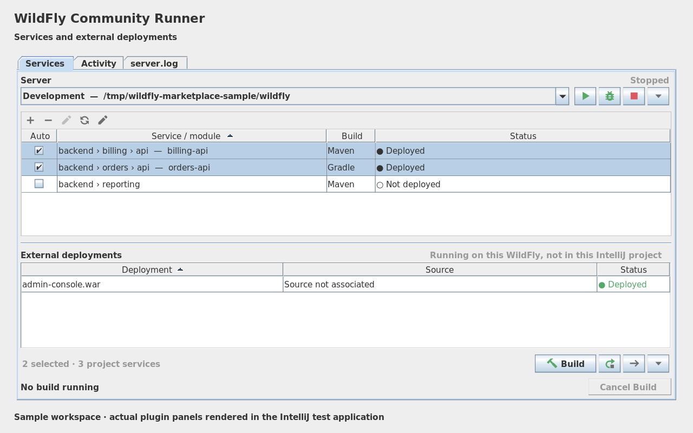
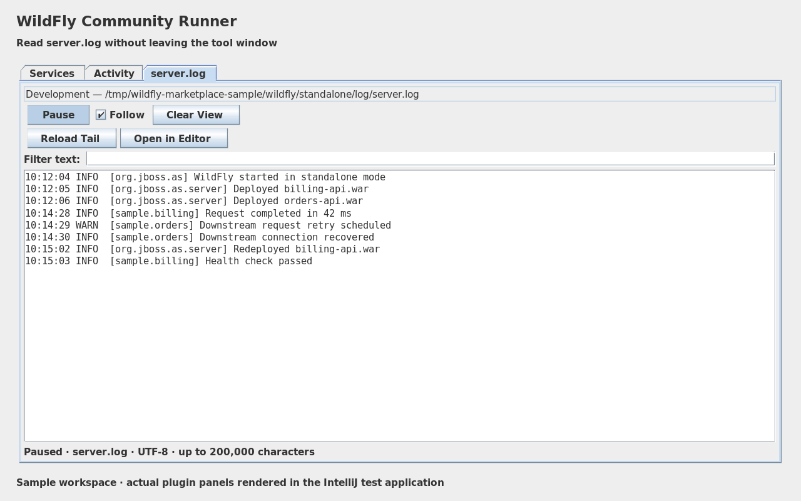

# WildFly Community Runner

Local WildFly integration for IntelliJ IDEA Community and compatible IntelliJ IDEA releases.
Build and deploy Maven/Gradle services, manage shared local servers, and use native
Run/Debug configurations. Version **0.6.0** is the Marketplace release candidate.

[Changelog](CHANGELOG.md) · [Troubleshooting](docs/TROUBLESHOOTING.md) ·
[Validation](docs/VALIDATION.md) · [Contributing](CONTRIBUTING.md) · [Releasing](docs/RELEASING.md)

## Installation

Use IntelliJ IDEA 2025.1–2026.2 with its Java and Maven plugins enabled. Download
the candidate ZIP from a successful GitHub Actions run, then choose **Settings →
Plugins → gear menu → Install Plugin from Disk**. Select the plugin ZIP, without
extracting it. The initial Marketplace listing still requires maintainer submission.

Install WildFly separately and select a JDK supported by that server version.
The plugin supports local standalone mode and requires no paid IDE application-server integration.

## First use

Open a trusted project. On its first setup, the plugin discovers nested Maven and
Gradle projects in the background. WAR, EAR, and Maven EJB modules are suggested
as applications. Library JARs and aggregator projects remain available through
**Add Service** when you explicitly want to deploy their output. Existing service settings take precedence, and
removing a service does not cause it to reappear on the next project open. Use
**Discover Projects** to add services later.

If global server setup has not yet been completed, a valid `WILDFLY_HOME` (then `JBOSS_HOME` as a
fallback) supplies a default standalone profile. Otherwise use the visible **Add
server…** button and select WildFly Home; `standalone.xml`, HTTP port 8080, and debug
port 8787 are defaults. Environment detection checks only those explicit paths.
It does not download WildFly or start/build/deploy anything during setup.
Removing a profile prevents environment detection from silently recreating it.

Saved Auto Redeploy watches initialize when a trusted project opens, including
when the WildFly tool window stays closed. Safe Mode disables automatic redeploy;
trusting the project enables initialization. Auto Redeploy still reacts only to
changes in the final WAR/EAR/JAR output.

## UI

The **WildFly** tool window has three tabs:

- **Services** — server controls, project services, external WildFly deployments, and contextual service actions.
- **Activity** — Maven/Gradle output, deployment activity, WildFly process output, and a `server.log` shortcut.
- **server.log** — a live, bounded viewer for the selected server profile's log.

Server controls are deliberately compact: Start, Debug, Stop, and a chevron menu. The menu contains debugger attach, server-profile management, `standalone.xml`, WildFly Home, deployments, and `server.log`.

The service list uses IntelliJ's collection toolbar for Add/Edit/Remove/Discover. Shift-click selects a range and Ctrl/Cmd-click toggles individual rows. Services are sorted lexicographically by their hierarchy-aware display name.



Component screenshots use sample data in the IntelliJ test application's default
Swing theme. See [image provenance](docs/MARKETPLACE.md#images).

## Project services

Each configured service stores:

- Maven or Gradle module build file, plus an optional reactor/root build file.
- Build goals/tasks, arguments, JVM options, and optional local build JAVA_HOME.
- WAR/EAR/JAR artifact configuration.
- Stable WildFly deployment name.
- Optional browser context path or full HTTP(S) URL.
- **Auto Redeploy** — watches the final WAR/EAR/JAR. Any rebuild of that artifact can trigger redeploy, including builds started from IntelliJ's Maven/Gradle tool windows or a terminal.

The first table column is **Auto**, not a selection/bulk flag. Selection is temporary action scope; Auto Redeploy is persistent behavior. Multi-select and the context menu can enable/disable Auto Redeploy for several services at once.

New services use Maven `package` or Gradle `build`, with tests enabled and Auto
Redeploy off. Existing saved build and Auto settings remain unchanged on upgrade.

Actions:

- **Build and Deploy** — the primary action; deploys after a successful build and temporarily suppresses the watcher to prevent duplicate redeploys.
- **Build Only** — builds without deploying and temporarily suppresses the watcher for the entire selected batch.
- **Redeploy** — deploys the latest built artifact.
- **Undeploy**.
- **Open in Browser**.

## External deployments

If the selected WildFly has active deployments that are not configured in the current IntelliJ project, they appear in a separate **External deployments** section beneath the project-service list.

The plugin keeps an application-wide registry of service source paths. A successful deployment or **Associate Source…** binds its exact deployment name and server instance to its source. That binding can be used to build and redeploy from another IntelliJ project window. Similar filenames or display names never establish a binding; old unscoped registry entries require explicit association. Unknown deployments can use **Associate Source…** to pick their build file, and remembered external services can be added to the current project with one action.

External deployments support redeploy, undeploy, browser launch, and — when a remembered source exists — build/source/artifact actions.

## Deployment status

The UI combines scanner markers with the selected local server state:

- **Deployed**
- **Deploying**
- **Failed**
- **Not deployed**
- **Server stopped** — saved markers do not imply a running application.
- **Unknown** — server identity or scanner configuration could not be verified.

These are scanner observations, not application health checks. Historical scanner markers such as `.undeployed` are not shown as separate persistent states. Status colors reuse IntelliJ's theme-aware success/warning/failure palette. Hover a deployment status to see the last successful deployment time, taken from WildFly's `.deployed` marker.

## Browser launch

**Open in Browser** uses the selected server's host and configurable HTTP port (default `8080`). If a service has a browser context-path override, that is used. Otherwise the context is derived from the deployment name, e.g. `orders.war` -> `http://localhost:8080/orders/`.

For unusual deployments where the WildFly context root differs from the WAR name,
set **Browser context path** or **Browser URL** in Service Details. The full URL
supports HTTPS and custom endpoints; IPv6 hosts are supported. EAR and JAR
deployments require an explicit context or URL because their web endpoint cannot
be inferred reliably.

## Server lifecycle across projects

WildFly server profiles are application-wide. A WildFly process started by the plugin is managed application-wide too, so opening another IntelliJ project does not start a duplicate instance. New projects reuse the last/active profile and can stop the managed process.

An externally started local JVM is shown as **Detected local WildFly** when its standalone launcher, WildFly Home, server base directory, and configuration match the profile. Detection works before HTTP becomes ready. An occupied HTTP port alone is shown as **server unverified** and blocks a duplicate launch.

For detected servers, Stop requires a unique local process match and rechecks its identity before termination. Windows uses a bounded, read-only local CIM query because JDK 21 does not expose process arguments there. Restricted process metadata leaves the server unverified. Ambiguous or remote processes are never killed automatically.

Profiles targeting the same instance share its managed process even when their profile IDs differ. Different configurations cannot start concurrently against the same server base directory. Path shortcuts honor `jboss.server.base.dir`, `jboss.server.config.dir`, and `jboss.server.log.dir` options. Deployment-scanner operations read the selected scanner from the profile's XML, including custom paths, named paths, and resolvable property expressions. The default scanner name is `default`. Missing, disabled, or unresolved scanners produce an actionable error before deployment.

Custom directory overrides containing spaces or shell metacharacters are rejected
before launch because WildFly distribution scripts parse them incorrectly. The
default standalone directories under a WildFly Home containing spaces are supported.

## WildFly profiles

Each profile supports:

- WildFly Home and `standalone*.xml`.
- Java Home.
- Expected HTTP host and port, used for detection and browser links. These do not change WildFly socket bindings.
- Scanner name and startup/deployment timeouts (default 120 seconds each).
- Configurable debug port (default `8787`).
- Startup arguments.
- WildFly JVM options.
- Expandable advanced JVM-option shortcuts/path pickers including Oracle `-Doracle.net.tns_admin=...`, trust store, key store, temp directory, and custom options.

## Maven and Gradle

Maven builds use IntelliJ's bundled Maven runner and its Maven configuration.
**Build JAVA_HOME** overrides the build JDK independently of the server JDK; when
empty, Maven keeps the IDE runner JRE and Gradle keeps its inherited environment.
Gradle builds are wrapper/CLI executions, not IntelliJ Gradle JVM executions.
Maven reuses an IDE SDK for the selected path or registers one, so native Maven
Rerun keeps the chosen JDK.

Gradle builds prefer the service's `gradlew` / `gradlew.bat`, walking upward from the selected module. If no wrapper is found, system Gradle is used.

For multi-module builds, set the same **Root build file** and build options on
the participating services. The batch runs that root build once, then deploys
each selected module's archive. Maven/Gradle handles dependency ordering; the
plugin does not infer a reactor from service selection. Artifact lookup remains
relative to each module.

Archive selection ignores common source, Javadoc, test, plain, and original JARs.
If multiple deployable candidates remain, set **Artifact override** explicitly;
the plugin does not choose the newest filename.

Selected services build sequentially, with progress in the tool window and IDEA's
background-task indicator. **Cancel Build** stops the owned build process and
skips queued services. Closing the tool window does not interrupt the batch;
closing the project cancels it. Only one batch runs per project at a time.

If a deployment has already been submitted, cancellation waits for its result
and displays **Cancelling after current deployment finishes…**. Explicit build
modes keep Auto Redeploy suppressed until that result arrives. A failed build or
deployment stops the queue. Stop in the native Maven console also cancels the batch.

Nested Maven/Gradle projects are discovered recursively (bounded depth) in addition to projects already imported by IntelliJ. Output/vendor directories such as `.git`, `.idea`, `.gradle`, `target`, `build`, `out`, and `node_modules` are skipped. Hierarchy is preserved visually, for example:

```text
backend › billing › api  —  billing-api
backend › orders › api   —  orders-api
```

## Auto Redeploy artifact watcher

Auto Redeploy is event-driven rather than a polling loop. The plugin registers the service output directory with Java's `WatchService` (`target/`, `build/libs/`, or the parent of an explicit artifact override). Source files are not watched.

When the final WAR/EAR/JAR changes, events are debounced, the file is sampled for
stability, and its ZIP structure and SHA-256 fingerprint are checked. The scanner
copy must match that fingerprint before replacing the previous deployment copy.
This catches changed content even when file size and timestamp are unchanged.
An unstable or incomplete archive is retried within a bounded window; rebuilding
the final artifact triggers a new check.

Changes arriving during a deployment are retained for a follow-up check. Deleted
output directories and watcher overflow trigger re-registration and an artifact
rescan. Initial project setup does not deploy pre-existing artifacts. Source
changes alone do not trigger deployment, including while the watcher temporarily
observes an output directory's parent. Gradle's `build/` artifact fallback is
covered alongside `build/libs/`.

Open projects coordinate automatic requests for the same deployment. Explicit
**Build and Deploy** / **Build Only** suppression follows the source
across projects, uses counted leases, and records the final build fingerprint
after a short settling period. Manual and automatic scanner operations targeting
the same deployment run sequentially. Duplicate deployment names within a selected
batch are rejected. Auto Redeploy skips a target associated with a different
source. Failed automatic deployments are retried
when artifact content changes; use **Redeploy** to retry unchanged output.

Resource usage is bounded: a blocking watcher and scheduled worker per configured
project, plus one application-wide suppression scheduler and a bounded cache of
successful automatic deployments. There is no periodic scan of source trees.

## Deployment / hot redeploy

Deployments require a verified running local server and an enabled scanner in the
selected XML. The plugin reads configuration; it does not change it or query a
management API. Changes made only in the running management model may require
saving/reloading the XML before the plugin can observe them. A deployment timeout
means confirmation was not received; the submitted request may still complete.

Deployments use WildFly's standalone deployment scanner. Built artifacts are copied to a temporary file, atomically replaced when possible, and then `.dodeploy` is created. Only the selected service is touched; other deployments remain running.

**Undeploy** handles project services and external deployments identically. For an active deployment it first removes WildFly's `.deployed` marker (the deployment-scanner undeploy command), waits briefly for scanner confirmation, then removes the scanner-managed artifact copy and residual markers from the configured scanner directory. Failed, pending, or artifact-only external deployments are cleaned up as well, so they cannot remain as stale scanner candidates. Source artifacts under Maven `target/` or Gradle `build/libs/` are never deleted.

External deployments without an associated source can still be redeployed by re-triggering `.dodeploy` on the artifact already present in the configured scanner directory.

## Debugging

IDEA's **Run → Edit Configurations → Add → WildFly** offers two native configuration types:

- **Local Server** — select an existing WildFly profile and optionally select applications. Run/Debug starts or reuses the server, waits for its expected HTTP endpoint, builds the selected applications, and deploys them. Leave the application list empty for a server-only session. Output appears in the standard Run/Debug console. Debug uses the profile's configured JDWP port and the Java debugger, including breakpoints and source navigation.
- **Attach Debugger** — use Debug to connect to an already running WildFly. Stopping this session disconnects the debugger and leaves the server running.

Configurations reference the application-wide profile by ID, with a unique profile
name as a fallback on another machine; JVM options and server paths stay local.
Application selections use project-relative build-file paths. Commit portable
service definitions (below) alongside a shared run configuration. Create the
corresponding local server profile on each machine. Missing or ambiguous servers
or services are reported instead of silently changing the selection.

A Local Server session reuses a managed server when possible. Stop terminates a server started by that session; Stop on a reused session only disconnects it. Detach leaves the global server available to other projects. An externally started server uses the Attach Debugger configuration. Stopping or detaching during application preparation cancels that session's build batch. Preparation failures fail the session and stop a server it started, while preserving a reused server. IDEA does not add an implicit Make task; the configured Maven/Gradle build owns compilation.

**Debug** starts WildFly with `--debug <configured-port>` when the server is stopped, then attaches IntelliJ's debugger. If a server is already detected externally, the plugin does not restart it; it attempts to attach to the configured debug port.

## Shared project settings

Use the service toolbar's **Shared Project Settings** action to save or reload
`.wildfly/services.xml`. Commit this file to share module paths, root builds,
tasks/arguments, artifact choices, deployment names, and browser endpoints.
Paths must stay inside the project; an artifact override is relative to its module.
Definitions load on trusted project startup and merge by module build-file path.
Reloading does not delete local services absent from the file.

```xml
<wildfly-services version="1">
  <service name="orders" buildSystem="MAVEN" buildFile="orders/pom.xml"
           buildRoot="pom.xml" packaging="war" tasks="package" arguments=""
           deploymentName="orders.war" artifact="target/orders.war"
           contextPath="/orders" browserUrl=""/>
</wildfly-services>
```

Server installations, JDK paths, JVM options, and Auto Redeploy choices stay local.
Imports preserve those local service values; new imported services have Auto off.
Known sensitive build arguments are rejected. Review ordinary arguments and URLs
before committing, as application-specific values may still be private.

## IntelliJ threading

Maven launch/document saving is dispatched through IntelliJ's application queue. Gradle process work, server detection, recursive discovery, deployment scanning, and other potentially blocking operations are kept off the Swing EDT where appropriate.

## Build

Requirements: JDK 21. Gradle 9.0.0 is pinned by the included wrapper with a SHA-256 checksum.

Keep the wrapper scripts, properties, and JAR in version control. They provide the
same Gradle version locally and in CI without requiring a separate Gradle install.
Set IntelliJ's Gradle JVM to JDK 21. The plugin targets Java 21 bytecode to support
IDEA 2025.1; installing a newer SDK does not change the runtime inside that IDE.

```bash
./gradlew verifyPluginProjectConfiguration test buildPlugin verifyPluginStructure
./gradlew verifyPlugin
```

Use `gradlew.bat` on Windows. The installable ZIP is generated under `build/distributions/`.
GitHub Actions builds on Linux, Windows, and macOS and verifies the pinned IntelliJ
release matrix on pull requests and pushes to `main`. See [validation](docs/VALIDATION.md)
for individual verifier targets, reports, and the current readiness status, and
[architecture](docs/ARCHITECTURE.md) for ownership and threading boundaries.

## Scope

Current scope is local WildFly **standalone mode**. Domain mode and remote deployment-management APIs are intentionally out of scope.

## Remembered sources and upgrades

The service toolbar's **Remembered Sources** action lists source associations shared
across IntelliJ projects. Use **Edit / Relink** after moving a source tree or
**Forget Selected** to remove a stale association. Availability checks run in the
background. An unavailable drive or missing build file never triggers automatic
deletion. Forgetting does not remove project profiles, source files, or deployed
archives; later discovery or building can remember that source again.

Settings upgrades migrate legacy Maven and single-service fields once, preserve
explicit Maven/Gradle configuration and empty arguments, and save a versioned
snapshot. Removing all services no longer resurrects legacy entries on restart.
Server edits are reflected in other open projects. Unloading the plugin detaches
its process listeners without terminating shared WildFly instances.

## Sensitive JVM properties

Properties with names ending in `password`, `passwd`, `pwd`, `secret`, `token`,
`credential(s)`, `apiKey`, `accessKey`, `privateKey`, or `secretKey` are saved in the
[IntelliJ Passwords store](https://plugins.jetbrains.com/docs/intellij/persisting-sensitive-data.html).
The JVM options field then shows `${secret:…}` references. For a sensitive property
with another name, use `-Dproperty=${env:VARIABLE}`; the variable must be present in
the IDE's environment. Oracle TNS and keyStore/trustStore path helpers remain ordinary
options. Use double quotes for values containing spaces.

WildFly and build JVM options resolve on background threads into temporary Java
argument files restricted to the filesystem owner. Secret values stay out of the
plugin's saved profiles, generated Maven run configuration VM options, and launch
command arguments. Maven Rerun creates a fresh file for each execution; saved native
Maven configurations retain credential references. Files are released after the
process exits or the plugin unloads. A native Maven launch that fails before supplying
a process handler releases its pending file when the project closes. Sensitive JVM
options use the standard local Maven runner; the experimental `maven.use.scripts`
runner and remote execution targets are outside this feature's scope.
Gradle builds using secrets run with `--no-daemon`. WildFly also uses private Java
argument files for quoted ordinary properties such as Oracle TNS paths. Their file
references pass through `JDK_JAVA_OPTIONS` so distribution scripts do not reparse
those values. Java argument-file support requires Java 9 or newer; runtime fixtures
use Java 21. Argument files use the system
launcher encoding (the Windows ANSI code page on a non-UTF-8 Windows installation).
Unsupported characters produce an error before launch, without replacing characters
in the credential. Use a UTF-8 system locale or the application's credential-file
support in that case. Ordinary options are unchanged.

Keep sensitive properties in **JVM options**. Sensitive values in build arguments,
build tasks/goals, or WildFly startup arguments are rejected with an explanation;
the plugin does not silently reinterpret Maven user properties as JVM properties.
Use the build tool's credential files when that distinction matters.

Older plugin settings migrate in the background. If PasswordSafe is locked or
unavailable, the plugin retains the previous values and reports how to fix storage.
An IDE configured not to retain passwords may require re-entering values after a
restart. References are local to that IDE's password store and are not portable
credentials. Plugin activity and the native WildFly console redact known values
and sensitive `-D` assignments; applications and third-party Maven/build logging
remain responsible for their own output. Stop and relaunch through the plugin after
unloading/reloading it before requesting a server restart that needs its private
argument file.

## Server log viewer



The **server.log** tab reads the selected profile's log in the background while the
tab is visible. It follows rotation, truncation, and delayed file creation, with no
open file handle between polls. Reads are bounded to the latest 256 KiB when
catching up, and the view retains at most 200,000 characters.

- **Pause** freezes the view; resuming catches up with the latest bounded tail.
- **Follow** scrolls to arriving lines. Turn it off to keep your reading position.
- **Filter text** matches complete lines literally, ignoring case.
- **Clear View** clears displayed lines without modifying the log file.
- **Reload Tail** rereads the current tail, including while paused.
- **Open in Editor** preserves access to the full file and the IDE's encoding tools.

The viewer decodes UTF-8 incrementally and waits for complete lines before showing
them. Lines longer than 65,536 characters are omitted. Invalid UTF-8 bytes display
as replacement characters; use the editor for logs in another encoding. Rotation
adds a separator while preserving the bounded recent history. Known values from
the active managed server and sensitive `-D` assignments are redacted; this does
not sanitize the underlying file or replace an application's logging policy.
There is no per-service log feature.

## License and project

[Apache-2.0](LICENSE). Independent community project; not affiliated with or endorsed
by Red Hat or JetBrains. See [security and sensitive data](SECURITY.md) before
sharing logs or credentials.
